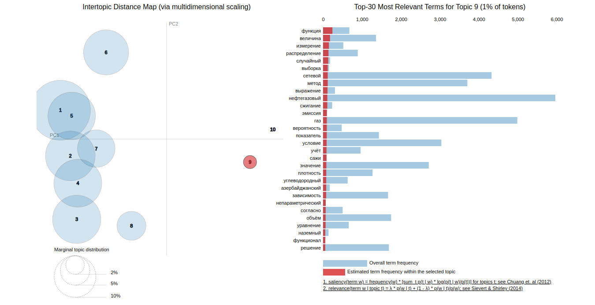

# Competence Graph for GPN

## Problem Description
The GPN company has a need to search for internal and external candidates for
new positions. Currently this process is time consuming and based only on tests
of the employee and does not cover possible competencies that they may have acquired before.
acquired before.

In order to select candidates who are not employed in the company 
it is necessary to analyze their CVs and publications and compare 
them with a competency model, to determine the employee's suitability 
to a certain profile or just to assess the level of their knowledge of 
a certain competency profile.

## Run code
<details>
  <summary>Instructions for Linux</summary>

1. If necessary, install dependent packages
  
  ```linux
  pip install -r requirements.txt 
  ```
2. **\[Optional]** Install Tesseract-OCR to get opportunity to work with unreadble pdf-files (e.g. broken encoding). 

>Install Tesseract:
```linux
sudo apt-get install tesseract-ocr
```

> Install Russian language: <br> 
```linux
sudo wget -P /usr/share/tesseract-ocr/4.00/tessdata https://github.com/tesseract-ocr/tessdata/raw/main/rus.traineddata
```

3. Run bash command in the root folder to create
clear text database:

  ```linux
  python3 script_transform_pdf.py 
  ```
> Note 1: You need the banch of pdf files in your **data/original_data** folder.

> Note 2: If you are doing it for the first time, change the **src/params.py** parameters from

```python
START_EXTRACTION = False
CREATE_CLEAR_TEXT = False
```

to

```python
START_EXTRACTION = True
CREATE_CLEAR_TEXT = True
```

> Parameters can be reset to their original state at a later time not to waste time processing them again.

4. Run bash command in the root folder to get keywords from test file:
  ```linux
  python3 script.py 
  ```
> Then entering name of the pdf-file from **data/test_folder**. For example:

```linux
1.pdf
```
4. Your result is located at:

```linux
data/result/result.xlsx
```
</details>

<details>
  <summary>Visualisation</summary>

### Competence graph for a sample of 1000 Oil & Gas articles
<p align="center">
  
</p>

> In the picture above, cluster 9 is a competence related to applied 
mathematical calculations and research.

</details>